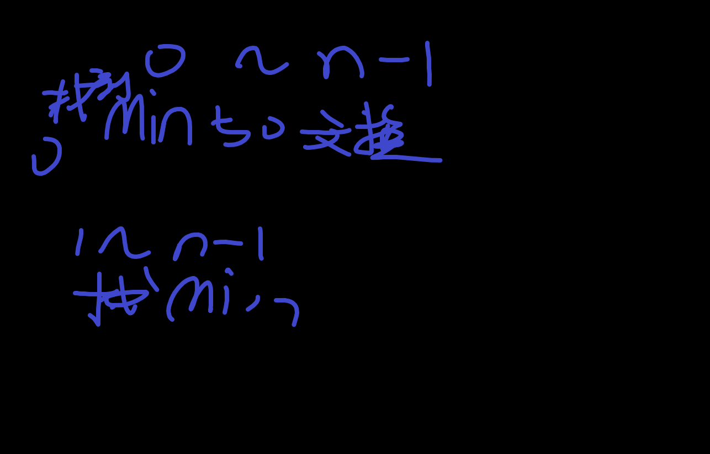
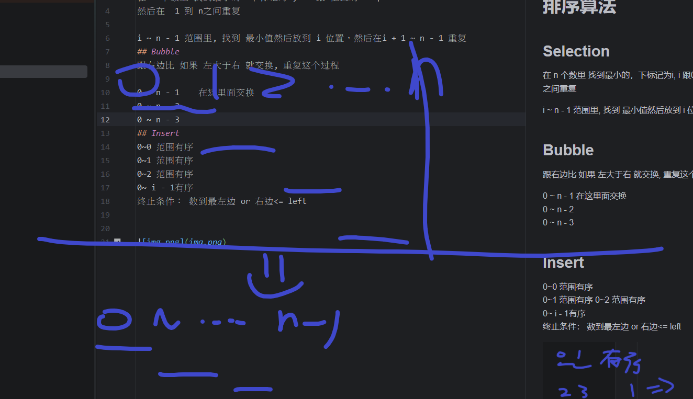
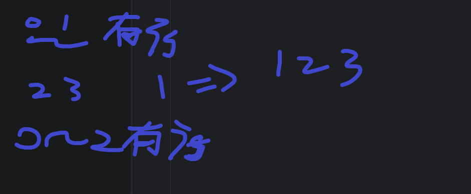

# 排序算法
## Selection
在 n 个数里 找到最小的，下标记为i,  i 跟0位置的 swap，
然后在  1 到 n之间重复

i ~ n - 1 范围里, 找到 最小值然后放到 i 位置，然后在i + 1 ~ n - 1 重复

## Bubble
跟右边比 如果 左大于右 就交换, 重复这个过程 

0 ~ n - 1    在这里面交换  
0 ~ n - 2  
0 ~ n - 3

## Insert 
0~0 范围有序  
0~1 范围有序
0~2 范围有序    
0~ i - 1有序   
终止条件： 数到最左边 or 右边<= left 

