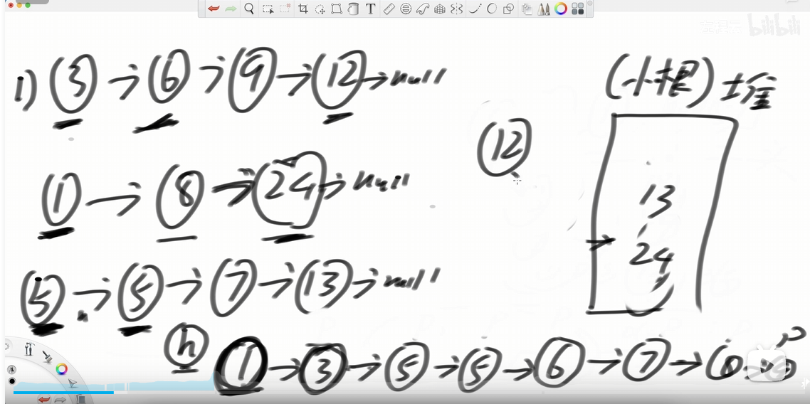

## 合并k 个有序链表
https://leetcode.cn/problems/merge-k-sorted-lists/description/

## 区间
https://leetcode.cn/problems/divide-intervals-into-minimum-number-of-groups/solutions/
根据左区间的大小，从小到大排序    
遍历给出的每个区间,  弹出 《= 左区间的数， 把右区间压入。
每一个遍历都计数min map 个数， 返回最大的数字