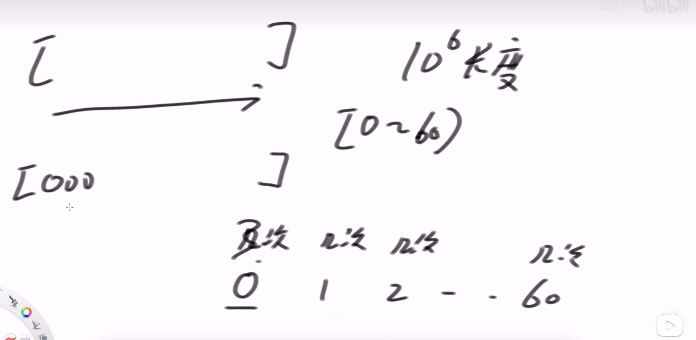
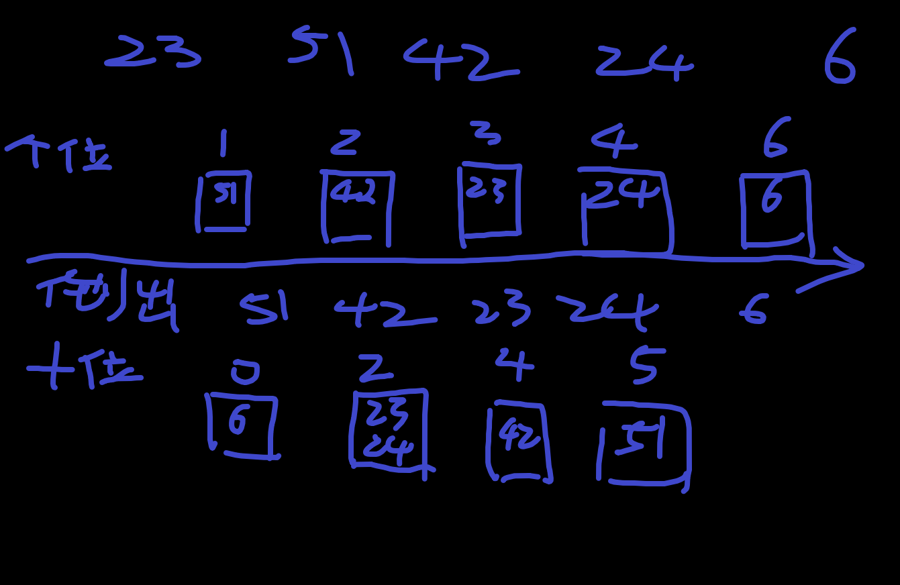
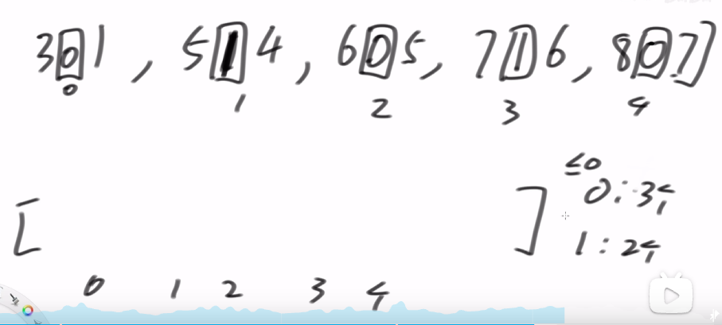
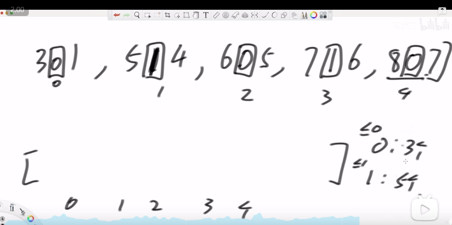

# 不基于比较的排序

## 计数排序
这里数据非常有特征 数组有10^6长度，但是数只在【0，60】之间 直接统计每个数出现多少次放进去即可  

## radix sort

桶先进先出 先排个位 再排十 

### 这里使用前缀和技巧
先统计 0 1， 2，3，...9 每一个出现的次数，然后变成前缀和形式

此时 前缀和就变成了数组下标， 放进去之后减一即可

### 提取数字某一位技巧
n为需要的数字 ,  
offset = 1,  
(n / offset) % 10
offset * 10